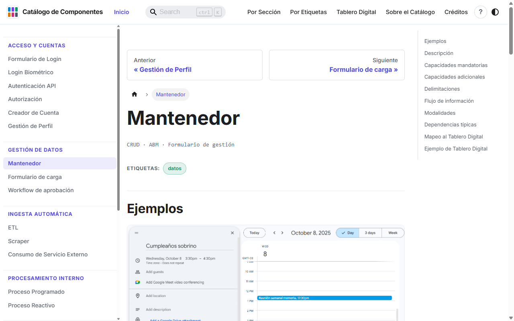

# Catálogo de Componentes

**Componentes de software recurrentes para sistemas de información, mapeados al Tablero Digital.**

Sitio: **https://catalogo-componentes-software.pages.dev**

[](https://github.com/Karmagro/catalogo-site/actions/workflows/verificar.yml)

## Qué es

Los sistemas de información se construyen, una y otra vez, con las mismas piezas: un formulario de login, un mantenedor de datos, un reporte, un proceso que corre de noche. Este catálogo las nombra y las documenta como **componentes**: tipos de funcionalidad recurrente definidos por su propósito, no por su implementación. Un Mantenedor es un Mantenedor en Java, en Python o en una planilla, y sirve para hablar del alcance de un sistema antes de decidir cómo se construye.

Cada uno de los **22 componentes** se describe con la misma ficha de once campos (alias, descripción, capacidades mandatorias y adicionales, delimitaciones, flujo de información, modalidades, dependencias típicas, ejemplos, mapeo al Tablero Digital y ejemplo de Tablero Digital), de modo que dos componentes se puedan comparar campo a campo. Las capacidades mandatorias dicen cómo reconocerlo en un sistema real; las delimitaciones dicen qué vecino del catálogo *no* es.

El catálogo se articula con el **Tablero Digital**, un instrumento del Departamento de Ciencias de la Computación de la Universidad de Chile para declarar el alcance de un sistema de información en seis secciones (Actualización Manual, Actualización Automática, Conceptos de Datos, Salidas por Demanda, Salidas Automáticas y Procesos Autónomos). Un componente no pertenece a una sección: toca varias a la vez, de forma mandatoria u opcional. Esa relación transversal es la [matriz de mapeo](https://catalogo-componentes-software.pages.dev/docs/secciones) y es lo que distingue a este catálogo de una taxonomía.

[](https://catalogo-componentes-software.pages.dev/docs/componentes/mantenedor)

## Cómo se navega

- **Recorrer** las fichas en el orden de la barra lateral: sigue el ciclo de vida de la información en un sistema (acceso, gestión de datos, ingesta, procesamiento, consulta, comunicación, registro).
- **[Por Sección](https://catalogo-componentes-software.pages.dev/docs/secciones):** qué componentes tocan cada sección del Tablero Digital, y con qué carácter.
- **[Por Etiquetas](https://catalogo-componentes-software.pages.dev/docs/etiquetas):** diez etiquetas transversales (autenticación, datos, integración, visualización…).
- **Buscar** con `Ctrl+K`.

## Correr el sitio

El sitio está hecho con [Docusaurus](https://docusaurus.io/) 3 y TypeScript. Requiere **Node 24** (`.nvmrc`; mínimo 22.18) y `npm`.

```bash
git clone https://github.com/Karmagro/catalogo-site.git
cd catalogo-site
npm ci                   # instala exactamente lo que fija package-lock.json
npm start                # servidor de desarrollo en http://localhost:3000
```

| Comando | Qué hace |
|---|---|
| `npm start` | Servidor de desarrollo con recarga en caliente |
| `npm run build` | Genera el sitio estático en `build/` |
| `npm run serve` | Sirve `build/` para revisarlo tal como quedará publicado |
| `npm run verificar` | Comprueba la coherencia del catálogo (fichas, tableros, mapeo, etiquetas, imágenes, enlaces, cifras). Menos de un segundo, sin red |
| `npm run verificar:todo` | `verificar` + chequeo de tipos + `build`. Es lo que corre la integración continua en cada *pull request* |

## Estructura del repositorio

```
catalogo-site/
├── docs/                         # Contenido del catálogo (MDX)
│   ├── componentes/              # Una ficha por componente (22) y _plantilla.mdx
│   ├── secciones.mdx             # Matriz componentes × secciones del Tablero
│   ├── tablero-digital.mdx       # Qué es el Tablero Digital
│   ├── sobre-el-catalogo.mdx     # Estructura de la ficha, audiencia, cómo usarlo
│   └── tags.yml                  # Las etiquetas del catálogo (única fuente)
├── src/
│   ├── data/
│   │   ├── mapeo/index.ts        # Mapeo de cada componente a las seis secciones (única fuente)
│   │   ├── tableros/<slug>.ts    # Post-its del Tablero Digital de ejemplo de cada ficha
│   │   └── ejemplos/<slug>.ts    # Capturas de la galería de cada ficha
│   ├── components/               # TableroDigital, Galeria, MapeoTablero, FichaTags, Tutorial
│   ├── css/                      # Estilos globales y de las fichas
│   ├── pages/                    # Inicio y Créditos
│   └── theme/                    # Piezas de Docusaurus sobreescritas (swizzle)
├── static/img/ejemplos/          # Imágenes de las galerías
├── sidebars.ts                   # Orden de lectura de las fichas
├── docusaurus.config.ts          # Configuración del sitio
├── scripts/verificar-catalogo.mjs
├── CHANGELOG.md                  # Qué cambió en cada versión
├── CONTRIBUTING.md               # Cómo proponer, escribir y publicar un componente
├── GUIA-TECNICA.md               # Cómo está hecho el sitio
└── DECISIONES.md                 # Por qué el catálogo es como es
```

## Versiones

Catálogo y sitio comparten un único número de versión, escrito solo en `package.json` y mostrado en la página de Créditos. Sigue el Versionado Semántico con las reglas leídas para un catálogo: cambia el **mayor** cuando cambia el modelo (los campos de la ficha, las secciones del Tablero) o se elimina, divide o fusiona un componente; el **menor** cuando se agrega sin romper (un componente, una etiqueta, un idioma); el **parche** cuando se corrige. El detalle de cada versión está en [`CHANGELOG.md`](CHANGELOG.md) y en las [*releases*](https://github.com/Karmagro/catalogo-site/releases).

## Contribuir

El catálogo está pensado para crecer más allá de su autor. [`CONTRIBUTING.md`](CONTRIBUTING.md) explica el criterio para decidir si algo es un componente nuevo, una modalidad o una capacidad adicional de uno existente; la lista de archivos que se tocan; el estilo de la ficha, y el flujo de ramas y *pull requests*. Las propuestas de componente parten por un [*issue* con la plantilla «Proponer un componente»](https://github.com/Karmagro/catalogo-site/issues/new/choose). Quien quiera entender cómo funciona el sitio por dentro tiene [`GUIA-TECNICA.md`](GUIA-TECNICA.md); quien quiera saber por qué se tomó cada decisión, [`DECISIONES.md`](DECISIONES.md).

## Origen y contexto académico

El catálogo es el artefacto principal de la memoria de título *Catalogación de componentes recurrentes de software, que forman parte de sistemas de información* (Carlos Gálvez Romo, Departamento de Ciencias de la Computación, Universidad de Chile, 2026), dirigida por los profesores Sergio Ochoa y Daniel Perovich. La memoria contiene el marco teórico, la construcción del catálogo, su validación sobre sistemas reales y la evaluación de usabilidad del sitio. Será publicada en el repositorio académico de la Universidad de Chile una vez concluido el proceso de titulación; este README se actualizará con el enlace.

Para citar el catálogo:

> Gálvez Romo, C. (2026). *Catálogo de Componentes: componentes de software recurrentes para sistemas de información*. Universidad de Chile, Departamento de Ciencias de la Computación. https://catalogo-componentes-software.pages.dev

## Licencia

En definición. Las capturas de pantalla de las galerías pertenecen a los sistemas que muestran y se usan con fines ilustrativos.
